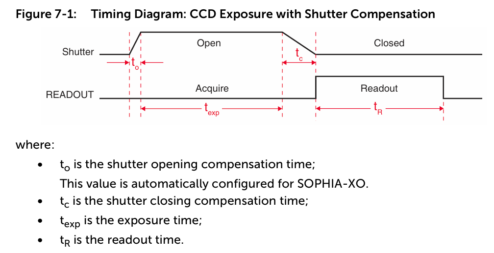
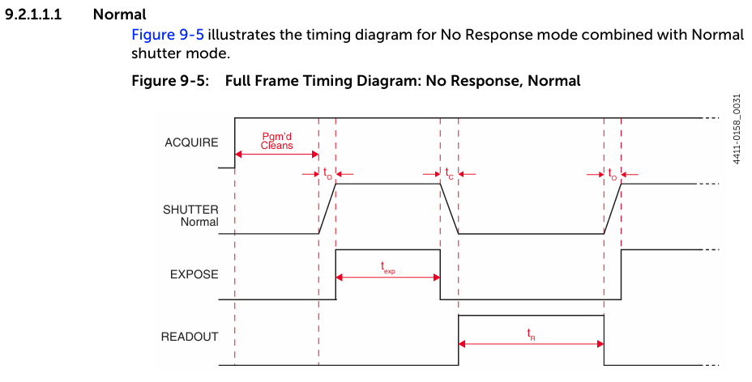
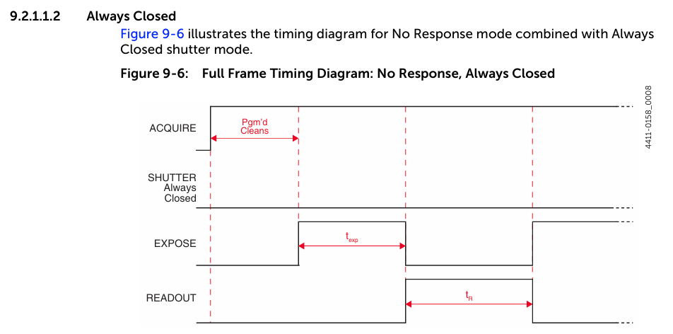
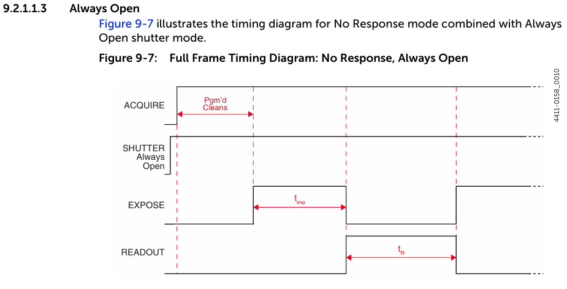

# SOPHIA-XO-System

## About CCD sensor

1. Signal

CCDセンサが計測した値、すなわち信号は以下の式で計算される

```math
Signal = QE * 感度 * PhotonCount
```

2. Noise
- ReadoutNoise
  - CCDから蓄積した電荷を読み出すときに発生するノイズ

- Sensitivity
  - 検出システムの特性を示すパラメータ

- DynamicRange
  - CCD素子のWellCapacityとReadOutNoiseによって決まる
  
- DarkCurrent(DarkCharge)
- PhotonShotNoise


## Exposure

#### Exposure Timeの定義

データ取得のコマンドをソフトウェアから要求して、センサ上の信号蓄積を止めるまでの時間



- $t_{o}$ : シャッターを開くのに要する時間
- $t_{c}$ : シャッターが閉まるのに要する時間
- $t_{exp}$ : 露光時間
- $t_{R}$ : 画像読み出し時間

#### Clean Until Trigger

外部トリガによるデータ取得を行う場合は、蓄積したダークカレントのクリーニングを行う
ライブモードでは、トリガなしの設定なので、この機能は無効となる
->クリーニングされないの前回画像の電荷が残っている可能性がある

## Full Frame Readout


## Calculating Image Acquisition/Readout Time

フルフレームのデータをフル解像度で集録して読み取るのに必要な合計時間は、次のように計算される

```math
t_{FF} = t_{R} + t_{exp} + t_{c}
```
ここで、

- $t_{R}$ : CCDのreadout時間
- $t_{exp}$ : 設定された露光時間
- $t_{c}$ : シャッターの開閉補正時間の合計

### CCD Readout Time

コントローラは自動でReadout Time $t_{R}$を計算する
これは、ROIの操作と処理のオーバーヘッド時間の概算を含む

CCDのReadout Timeは次の式で概算される

```math
t_{R} = (N_{y} * t_{i}) + (N_{y} * N_{x} * t_{pix})
```

ここで、
- $t_{R}$ : readout time
- $N_{y}$ : CCD内の行数
  - SOPHIA-XOのReadoutPortが4で設定されているとき、$N_{y} = \sqrt{CCDの総行数}$
  - 例えば、CCDの高さが2048行の場合、$N_{y}=1024$
- $N_{x}$ : CCD内の列数
  - SOPHIA-XOのReadoutPortが2または4で設定されているとき、$N_{x} = \sqrt{CCDの総列数}$
  - 例えば、CCDの幅が2048列の場合、$N_{x}=1024$
- $t_{pix}$ : 1つの画素の処理に要する時間

CCDのサブセクションはフル解像度で読み出すことができ、フルCCDの寸法の代わりに関心領域(ROI)で最高の分解能を維持しながら、読み出し速度を劇的に向上させる場合があります。ただし、不要なピクセルを読み出して破棄するには、ある程度のオーバーヘッド時間が必要です。

Readoutに関する設定はAPIは、以下
- PicamReadoutControlMode

|Enumerator|Description|
|---|---|
|PicamReadoutControlMode_Dif|センサーが2つのフレームを高速に取得し、両方を読み取るデュアルイメージング機能|
|PicamReadoutControlMode_ExposeDuringReadot|次のフレームの露光中にフレームをReadoutする|
|PicamReadoutControlMode_FrameTransfer|次のフレームの露光中にフレームをReadoutする|
|PicamReadoutControlMode_FullFrame|センサは1度に1フレームずつ読み出す|
|PicamReadoutControlMode_Interline|次のフレームの露光中にフレームをReadoutする|
|PicamReadoutControlMode_Kinetics|センサは高速に複数のフレームを蓄積し、読み出す|

## Experiment Timing

外部トリガパルスは制御に利用される

- シャッターオペレーション
- データ読み出し

### Trigger Response
Trigger Response parameterは、どのように受信したトリガパルスによって画像データを読み出すかを定義する。パラメータは次の通り

- No Response
- Start on Single Trigger
- Readout Per Trigger
- Expose During Trigger Pulse

#### No Response

"No Response"を選択すると、入力トリガパルスは無視されます。このモデルは、通常、一定の光源(CEレーザー、DCランプなど)を組み込んだ実験に使用されます。このモデルを使用できる他の実験は、1回のシャッターサイクル中に発生する光インパルスの数が非常に多いため、光源が連続的に照らされた光源であるように見える高反復研究です。

サポートされているシャッターモードは以下
- Normal
- Always Closed
- Always Open

対応するAPIのパラメータは以下の表
- PicamShutterTimingMode

|Enumerator|Description|
|---|---|
|PicamShutterTimingMode_Normal|露光中のみシャッターを開く|
|PicamShutterTimingMode_AlwaysClosed|シャッターを常に閉じる|
|PicamShutterTimingMode_AlwaysOpen|シャッターを常に開く|
|PicamShutterTimingMode_OpenBeforeTrigger|トリガを待っている間、先にシャッターが開く。トリガに反応して開くPicamShutterTimingMode_Normalとは異なる|

##### Normal







## Kinetics Readout

連続する画像フレーム間の時間は、24usという短い場合があり、マスクの下で画像をシフトするのに必要な時間によって制限されます。連続する画像フレーム間の時間は、設定されたストレージシフトレート(ns/行)に、設定されたキネティクスウィンドウの高さ(行単位)を掛けることによって計算されます。